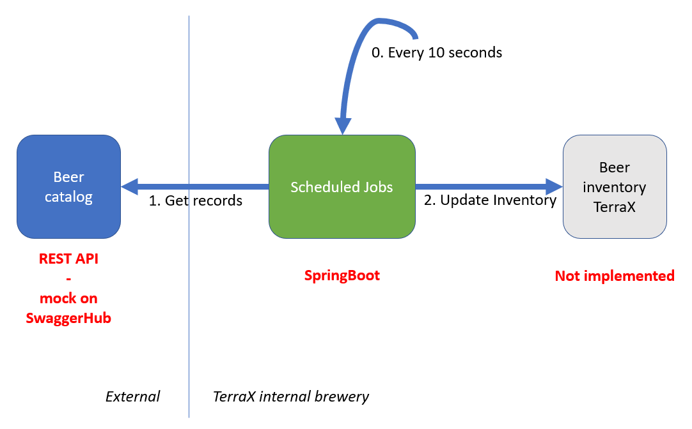

# sb-scheduled-batch-jobs

There are plenty of Spring guides that get you started on lots of topics: https://spring.io/guides. But every now and then, you need to combine topics to achieve your goal. This is such an example, where we want to:
- invoke a REST Service that returns a number of records 
- process these records one-by-one (=batch processing)
- ... and do that on a scheduled interval (=task scheduling)

## Overview 

As always, this example is situated in the Terra 10 beer brewery:



In the above figure:

**Beer catalog**

An external REST API that returns a list of beer records:

```bash
developer@developer-VirtualBox:~$ curl https://virtserver.swaggerhub.com/TerraX_Brewery/Beercatalog/1.0.0/beers
[ {
  "id" : "d290f1ee-6c54-4b01-90e6-d701748f0851",
  "name" : "TerraX Tripel",
  "releaseDate" : "2019-01-28T09:12:33.001Z",
  "manufacturer" : {
    "name" : "TerraX Brewery",
    "homePage" : "https://terra10.io",
    "phone" : "123-555-666"
  }
}, {
  "id" : "d290f1ee-6c54-4b01-90e6-d701748f0852",
  "name" : "TerraX Golden Dragon",
.....
```
It is implemented as an mock service in SwaggerHub. Note that all sources can be found on GitHub: https://github.com/lgorissen/sb-scheduled-batch-jobs.git. The Swagger definition can be found there as file `TerraX_Brewery-Beercatalog-1.0.0-swagger.yaml`. 

**Scheduled Jobs**

This is the core part of this blog: a Spring Boot service that schedules a job every 10 seconds, that:
1. Queries the *Beer catalog* service for a list of beer records
2. Processes each beer record, i.e. one-by-one

The goal is to achieve the above functionality with as little code as possible, i.e. maximal leveraging of the Spring Boot features.

## Code highlights

The table below shows the java files:

|   File   |  Description |
|----------|--------------|
| io/terrax/brewery/beer/Beer.java | Defines the records from the Beer catalog API - Beer |
| io/terrax/brewery/beer/Manufacturer.java | Defines the records from the Beer catalog API - Manufacturer  |
| io/terrax/brewery/beer/inventory/Application.java | Schedules Jobs - the Spring Boot application |
| io/terrax/brewery/beer/inventory/JobCompletionNotificationListener.java | Logic that is executed when job is completed | 
| io/terrax/brewery/beer/inventory/ScheduledTasks.java | Job definition and scheduling  | 
| io/terrax/brewery/beer/inventory/job/BeerCatalogReader.java | Job step - for reading from Beer catalog API | 
| io/terrax/brewery/beer/inventory/job/BeerInventoryWriter.java | Job step - for updating the Beer inventory TerraX | 
| io/terrax/brewery/beer/inventory/job/BeerProcessor.java | Job step - for internal transformation of Beer records | 


### Beer.java and Manufacturer.java

Both `Beer.java` and `Manufacturer.java` are business classes that represent the beer records that are received from the Beer catalog API. What more is there to say ...


### Application.java

The `Application.java` starts the Spring Boot application. Note that it enables both Scheduling and BatchProcessing:

```java
...
@SpringBootApplication
@EnableScheduling              // enable scheduling 
@EnableBatchProcessing         // enable batch processing
public class Application {

    public static void main(String[] args) throws Exception {
        SpringApplication.run(Application.class, args);
    }
}

```

### ScheduledTasks.java

By far the most interesting part: the job scheduling happens here. The most interesting parts:

- ScheduledTasks is a SpringBoot Component, thus registering this class as a Bean
- A JobLauncher, JobBuilderFactory and StepBuilderFactory are autowired as they are needed for handling jobs 
- A JobCompletionNotificationListener is needed for executing logic upon Job completion 
- @Scheduled annotation schedules a void method for execution. In this example, the method is executed 5000msec after the previous execution has finished
 

```java
@Component
public class ScheduledTasks {

	private static final Logger log = LoggerFactory.getLogger(ScheduledTasks.class);
	private static final SimpleDateFormat dateFormat = new SimpleDateFormat("HH:mm:ss");

	@Autowired
	JobLauncher jobLauncher;

	@Autowired
	private JobBuilderFactory jobs;

	@Autowired
	private StepBuilderFactory steps;

	@Autowired
	JobCompletionNotificationListener listener;
	
	@Autowired
	Environment environment;

	@Scheduled(fixedDelay = 5000)
	public void updateBeerInventory() {

		log.info("Updating beer inventory for Terra10 {}", dateFormat.format(new Date()));

		try {
			
			RestTemplate restTemplate = new RestTemplate();  // for REST call to Beer catalog API
                        // A Job consists of
                        // - an ItemReader
                        // - an ItemProcessor
                        // - an ItemWriter

			ItemReader<Beer> restBeerReaderLocal = new BeerCatalogReader(environment.getRequiredProperty("rest.api.to.beer.catalog.url"), restTemplate);
			
			ItemProcessor<Beer, Beer> restBeerProcessorLocal = new BeerProcessor();

			ItemWriter<Beer> restBeerWriterLocal = new BeerInventoryWriter();
			

		        // Define a Job Step 	
			Step restBeerStepLocal = steps.get("restBeerStepLocal")          // get new StepBuilder
                                                      .allowStartIfComplete(true)        // allow job to be re-started
                                                      .<Beer, Beer>chunk(1)              // step processes chunks of size 1
                                                      .reader(restBeerReaderLocal)       // add the reader
			                              .processor(restBeerProcessorLocal) // add the processer
                                                      .writer(restBeerWriterLocal)       // add the writer
                                                      .build();                          // build the step
		        // Define a Job	
			Job restBeerJobLocal = jobs.get("restBeerJobLocal")              // get new JobBuilder
                                                   .incrementer(new RunIdIncrementer())  // increment Run.id parameter 
                                                   .listener(listener)                   // at job listener to JobBuilder
                                                   .flow(restBeerStepLocal)              // add step to JobBuilder
                                                   .end()                                // let JobFlowBuilder build
                                                   .build();                             // inject into parent builder
			
			jobLauncher.run(restBeerJobLocal, new JobParameters());
		} catch (Exception e) {
			// TODO: handle exception
			e.printStackTrace();
		}
	}
```

### BeerCatalogReader.java

The BeerCatalogReader is the ItemReader of the Job. It reads the records from the Beer catalog API.

```java
package io.terrax.brewery.beer.inventory.job;

...

public class BeerCatalogReader implements ItemReader<Beer> {
	 
	 
    public BeerCatalogReader(String apiUrl, RestTemplate restTemplate) {
        this.apiUrl = apiUrl;                       // api endpoint needed for doing the REST call
        this.restTemplate = restTemplate;           // restTeample needed for doing the REST call
        nextBeerIndex = 0;
    }
 
    @Override
    public Beer read() throws Exception {           // ItemReader needs a read() method
        if (beerDataIsNotInitialized()) {
            beerData = fetchBeerDataFromAPI();
        }
 
        Beer nextBeer = null;
 
        if (nextBeerIndex < beerData.size()) {
            nextBeer = beerData.get(nextBeerIndex);
            nextBeerIndex++;
        }
 
        return nextBeer;                            // the read() method returns the beers one-by-one
    }

...
 
}

```


### BeerInventoryWriter.java

The BeerInventoryWriter is the ItemWriter of the Job. It writes the records to the Beer inventory ... well: we only write a log line

```java
package io.terrax.brewery.beer.inventory.job;

...

public class BeerInventoryWriter implements ItemWriter<Beer> {

    private static final Logger log = LoggerFactory.getLogger(BeerInventoryWriter.class);
	
    @Override
    public void write(List<? extends Beer> items) throws Exception {  // in the write method, beer records are processed

        items.forEach(i -> log.info("Adding beer to inventory: " + i.getName()));  // instead of writing them to an inventory ...
                                                                                   // we only write a log line
    }
}

```

### BeerProcessor.java

In the BeerProcessor, it is possible to do some processing, like e.g. data enrichment on the received Beer records.


```java
package io.terrax.brewery.beer.inventory.job;

...

public class BeerProcessor implements ItemProcessor<Beer, Beer> {

	private static final Logger log = LoggerFactory.getLogger(BeerProcessor.class);

	@Override
	public Beer process(Beer item) throws Exception {

		log.info("Processing beer information: {}", item.getName());
		
		// you could do some work on the Beer item here

		return item;
	}
}
```

All three together, the BeerCatalogReader, BeerProcessor and BeerInventoryWriter are a typical ETL pattern, where:
- Extraction: the BeerCatalogReader
- Transformation: the BeerProcessor
- Load: the BeerInventoryWriter


## Build and Run

The application first has to be build:
```bash
developer@developer-VirtualBox:~/projects/scheduled-batch-jobs$ ls
mvnw      overview.png  README.md  target
mvnw.cmd  pom.xml       src        TerraX_Brewery-Beercatalog-1.0.0-swagger.yaml
developer@developer-VirtualBox:~/projects/scheduled-batch-jobs$ ./mvnw clean package
[INFO] Scanning for projects...
[INFO] 
[INFO] -------------------< io.terrax:scheduled-batch-jobs >-------------------
[INFO] Building scheduled-batch-jobs 0.0.1-SNAPSHOT
[INFO] --------------------------------[ jar ]---------------------------------
[INFO] 
[INFO] --- maven-clean-plugin:3.1.0:clean (default-clean) @ scheduled-batch-jobs ---
[INFO] Deleting /home/developer/projects/scheduled-batch-jobs/target
[INFO] 

...
...

[INFO] --- spring-boot-maven-plugin:2.1.2.RELEASE:repackage (repackage) @ scheduled-batch-jobs ---
[INFO] Replacing main artifact with repackaged archive
[INFO] ------------------------------------------------------------------------
[INFO] BUILD SUCCESS
[INFO] ------------------------------------------------------------------------
[INFO] Total time:  3.599 s
[INFO] Finished at: 2019-02-09T20:20:57+01:00
[INFO] ------------------------------------------------------------------------
developer@developer-VirtualBox:~/projects/scheduled-batch-jobs$ 

```

After a successful build, the application can be run.

```bash
developer@developer-VirtualBox:~/projects/scheduled-batch-jobs$ java -jar target/scheduled-batch-jobs-0.0.1-SNAPSHOT.jar 

  .   ____          _            __ _ _
 /\\ / ___'_ __ _ _(_)_ __  __ _ \ \ \ \
( ( )\___ | '_ | '_| | '_ \/ _` | \ \ \ \
 \\/  ___)| |_)| | | | | || (_| |  ) ) ) )
  '  |____| .__|_| |_|_| |_\__, | / / / /
 =========|_|==============|___/=/_/_/_/
 :: Spring Boot ::        (v2.1.2.RELEASE)

2019-02-09 20:25:00.747  INFO 22523 --- [           main] i.t.brewery.beer.inventory.Application   : Starting Application v0.0.1-SNAPSHOT on developer-VirtualBox with PID 22523 (/home/developer/projects/scheduled-batch-jobs/target/scheduled-batch-jobs-0.0.1-SNAPSHOT.jar started by developer in /home/developer/projects/scheduled-batch-jobs)
2019-02-09 20:25:00.752  INFO 22523 --- [           main] i.t.brewery.beer.inventory.Application   : No active profile set, falling back to default profiles: default
2019-02-09 20:25:01.744  INFO 22523 --- [           main] com.zaxxer.hikari.HikariDataSource       : HikariPool-1 - Starting...
2019-02-09 20:25:01.749  WARN 22523 --- [           main] com.zaxxer.hikari.util.DriverDataSource  : Registered driver with driverClassName=org.hsqldb.jdbcDriver was not found, trying direct instantiation.
2019-02-09 20:25:02.074  INFO 22523 --- [           main] com.zaxxer.hikari.pool.PoolBase          : HikariPool-1 - Driver does not support get/set network timeout for connections. (feature not supported)
2019-02-09 20:25:02.080  INFO 22523 --- [           main] com.zaxxer.hikari.HikariDataSource       : HikariPool-1 - Start completed.
2019-02-09 20:25:02.103  INFO 22523 --- [           main] o.s.b.c.r.s.JobRepositoryFactoryBean     : No database type set, using meta data indicating: HSQL
2019-02-09 20:25:02.135  INFO 22523 --- [           main] o.s.b.c.l.support.SimpleJobLauncher      : No TaskExecutor has been set, defaulting to synchronous executor.
2019-02-09 20:25:02.363  INFO 22523 --- [           main] o.s.s.c.ThreadPoolTaskScheduler          : Initializing ExecutorService 'taskScheduler'
2019-02-09 20:25:02.414  INFO 22523 --- [           main] i.t.brewery.beer.inventory.Application   : Started Application in 2.106 seconds (JVM running for 2.629)
2019-02-09 20:25:02.416  INFO 22523 --- [           main] o.s.b.a.b.JobLauncherCommandLineRunner   : Running default command line with: []
2019-02-09 20:25:02.417  INFO 22523 --- [   scheduling-1] i.t.b.beer.inventory.ScheduledTasks      : Updating beer inventory for Terra10 20:25:02
2019-02-09 20:25:02.559  INFO 22523 --- [   scheduling-1] o.s.b.c.l.support.SimpleJobLauncher      : Job: [FlowJob: [name=restBeerJobLocal]] launched with the following parameters: [{}]
2019-02-09 20:25:02.596  INFO 22523 --- [   scheduling-1] o.s.batch.core.job.SimpleStepHandler     : Executing step: [restBeerStepLocal]
2019-02-09 20:25:03.569  INFO 22523 --- [   scheduling-1] i.t.b.beer.inventory.job.BeerProcessor   : Processing beer information: TerraX Tripel
2019-02-09 20:25:03.570  INFO 22523 --- [   scheduling-1] i.t.b.b.i.job.BeerInventoryWriter        : Adding beer to inventory: TerraX Tripel
2019-02-09 20:25:03.573  INFO 22523 --- [   scheduling-1] i.t.b.beer.inventory.job.BeerProcessor   : Processing beer information: TerraX Golden Dragon
2019-02-09 20:25:03.573  INFO 22523 --- [   scheduling-1] i.t.b.b.i.job.BeerInventoryWriter        : Adding beer to inventory: TerraX Golden Dragon
2019-02-09 20:25:03.575  INFO 22523 --- [   scheduling-1] i.t.b.beer.inventory.job.BeerProcessor   : Processing beer information: TerraX Bock
2019-02-09 20:25:03.575  INFO 22523 --- [   scheduling-1] i.t.b.b.i.job.BeerInventoryWriter        : Adding beer to inventory: TerraX Bock
2019-02-09 20:25:03.577  INFO 22523 --- [   scheduling-1] i.t.b.beer.inventory.job.BeerProcessor   : Processing beer information: TerraX Double
2019-02-09 20:25:03.577  INFO 22523 --- [   scheduling-1] i.t.b.b.i.job.BeerInventoryWriter        : Adding beer to inventory: TerraX Double
2019-02-09 20:25:03.579  INFO 22523 --- [   scheduling-1] i.t.b.beer.inventory.job.BeerProcessor   : Processing beer information: TerraX Weizen
2019-02-09 20:25:03.580  INFO 22523 --- [   scheduling-1] i.t.b.b.i.job.BeerInventoryWriter        : Adding beer to inventory: TerraX Weizen
2019-02-09 20:25:03.589  INFO 22523 --- [   scheduling-1] .b.b.i.JobCompletionNotificationListener : Job Completed: beer inventory updated!
2019-02-09 20:25:03.591  INFO 22523 --- [   scheduling-1] o.s.b.c.l.support.SimpleJobLauncher      : Job: [FlowJob: [name=restBeerJobLocal]] completed with the following parameters: [{}] and the following status: [COMPLETED]
2019-02-09 20:25:08.592  INFO 22523 --- [   scheduling-1] i.t.b.beer.inventory.ScheduledTasks      : Updating beer inventory for Terra10 20:25:08
2019-02-09 20:25:08.628  INFO 22523 --- [   scheduling-1] o.s.b.c.l.support.SimpleJobLauncher      : Job: [FlowJob: [name=restBeerJobLocal]] launched with the following parameters: [{}]
2019-02-09 20:25:08.639  INFO 22523 --- [   scheduling-1] o.s.batch.core.job.SimpleStepHandler     : Executing step: [restBeerStepLocal]

```
Watch the log lines to see the beer records being processed.

All the sources can be found on github: https://github.com/lgorissen/sb-scheduled-batch-jobs 

Enjoy!
 

